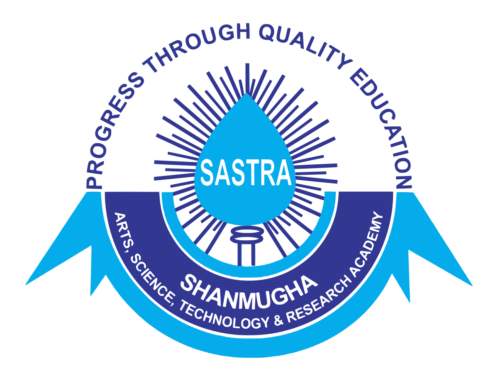

* Received the Dr. Helen Wu Award from Rackham Graduate School for Spring/Summer 2024.
*  Awarded the Barbour Scholarship from Rackham Graduate School for the academic year 2024-25.
* Received the Rackham Conference Travel Grant from Rackham Graduate School for the academic year 2024-25.
   
  

  
  Inducted into the Excellence in ECE Honor Roll 2023-24 for service to the ECE department through contributions to department-specific events and programming designed to foster an inclusive, supportive community for all.
   
  

  
  Awarded the Research Excellence Award from Brigham Research Institute for outstanding contributions to research at Brigham and Women’s Hospital on Nov-12,2020.
   
  

  
  Received the Desh Videsh Scholarship for pursuing my bachelor's thesis at Harvard Medical School, MA, USA.
   
  
  

  
  Awarded the Smt. K.Thulasi Memorial Award for best outgoing student from School of Electrical and Electronics Engineering amongst the graduating batch of 2019.
   
  
  

  
   Awarded the Dr. V.Jayashankar Award for student who has secured highest CGPA., upto VII Semester in the B.Tech.-Electronics and Instrumentation Engineering & M.Tech (5-year Integrated) Instrumentation & Control Programme.
   
  
  

  
   Awarded the Shri. Vishwantha Iyer Award for best outgoing student from the Department of Electronics and Instrumentation Engineering amongst the graduating batch of 2019.
   

  

  
   Awarded the Shri. A.Venkataraman Award for academic excellence.
   

  

  
  Awarded the prestigious Young Environmental Scientist-2014 Award from IWMA. 
   
  
