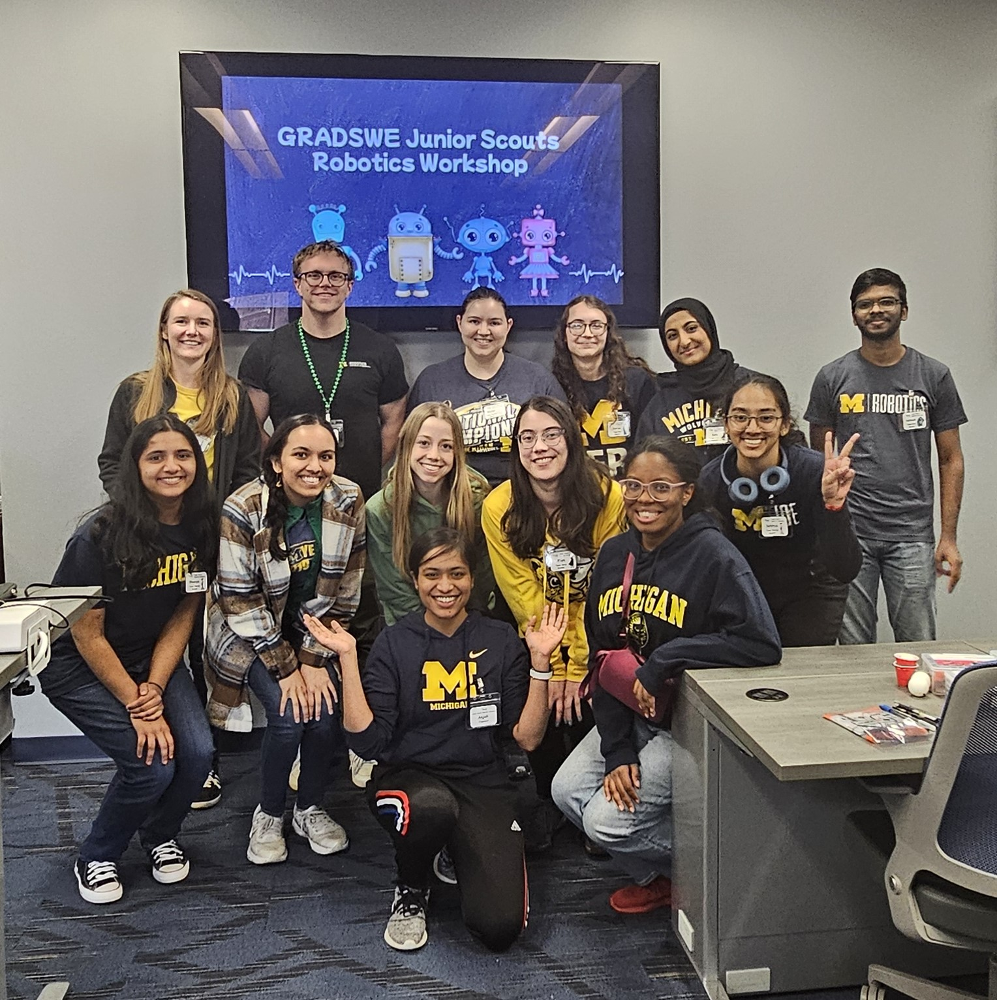

<b>K12 Outreach</b>
====================
<b> Graduate Society of Women Engineers (GradSWE), University of Michigan Ann Arbor, MI </b>
 Senior K12 Outreach Officer May 2023- Present
    
  

  
  Organized and led robotics workshop modules for Junior Girl Scouts, engaging over 25 participants during Winter
2024, Fall 2024, and Winter 2025, sponsored by Aptiv and the UM Center for Educational Outreach (CEO). 
  

   
  

  
  Co-organized Explorer Day sponsored by Aptiv in Fall 2024, welcoming 15+ children from the Community Action Network (CAN), which supports under-resourced families in Washtenaw County; the event featured a visit to the UM campus and the Natural History Museum. 
  

<b>Mentoring Experience</b>
============================
2021-Present: Research Mentor, University of Michigan: 9 Undergrads and 2 Master's Students
- Tianyue Li (B.S., CSC, 2022-2023)
- Bryan Li (B.S., ECE, 2023-2024)
- Eric Ding (B.S., CSC, 2023)
- Yiting Lai (B.S., ECE, 2023)
- Jackie Lin (B.S., CSC, 2023-2024)
- Ava Fisher (B.S., BME, 2023-2024)
- Arnav Sadasivan (B.S., CSC, 2023-2024)
- Ryan Wang (B.S., ECE, 2024)
- Andres Link (B.S., 2024-2025)
- Sumedh Yewale (M.S., BME, 2024-2025)
- Yamini Sri Krubha (M.S., ECE, 2025-present) 

